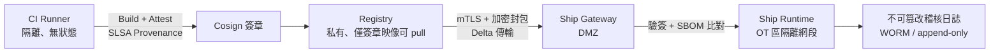
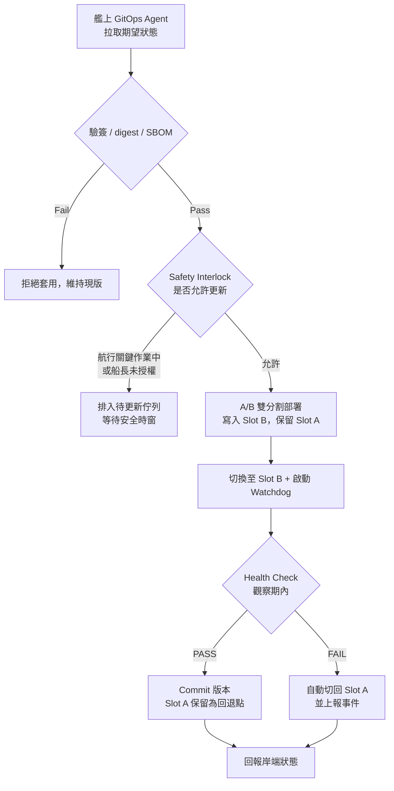

# CI/CD Pipeline 技術設計文件

> 情境：船廠研發團隊（岸端）將 `ros2-web-monitoring` 系統，從 Git Repository 安全、可靠地交付到遠端多艘船艦（艦隊），過程中需具備 **Quality**、**Security**、**Safety** 控管，並導入 **AI** 輔助。

| 項目 | 內容 |
| :--- | :--- |
| 文件版本 | v1.0 |
| 適用系統 | ROS 2 GNSS Publisher + FastAPI Bridge + Vue 3 Dashboard |
| 交付形式 | 容器映像（OCI Image）+ 宣告式部署設定 |
| 部署對象 | 遠端艦隊（Ship A ~ Ship D，可水平擴充） |
| 文件性質 | Architecture / System Design（文字 + 圖表） |

---

## 1. 設計目標與範圍

### 1.1 目標

1. **單一來源**：所有交付物皆由 Git 的 commit 產生，可完整追溯（Traceability）。
2. **左移把關**：品質與資安檢查在 CI 階段完成，不通過即禁止進入部署。
3. **漸進式交付**：艦隊不可同時更新；以 Canary 分批推進，異常自動回滾。
4. **離線容忍**：船岸鏈路（衛星／4G）頻寬低且會中斷，部署機制必須可斷點續傳、可離線自我復原。
5. **AI 輔助**：以 AI 提升審查效率、測試覆蓋與異常偵測靈敏度，但 **AI 不具備 Gate 的最終決策權**。

### 1.2 範圍內（In Scope）

- 分支與版本策略、CI 流程、品質門檻、資安掃描、製品簽章
- 岸端 Staging 驗證、審批機制、艦上 GitOps Agent 拉取式部署
- Canary／健康檢查／自動回滾、部署後監控與 AI 分析

### 1.3 範圍外（Out of Scope）

- 航行關鍵系統（Navigation / Propulsion）之部署；本系統定位為 **非安全關鍵之監控系統**，需與關鍵網段隔離
- 硬體維護、實體安全、船員操作訓練

### 1.4 環境限制（Constraints）

| 限制 | 影響 | 設計對應 |
| :--- | :--- | :--- |
| 船岸鏈路頻寬低、延遲高、常中斷 | 無法即時 Push 部署 | Pull-based GitOps + Delta 傳輸 + Store-and-forward |
| 岸端無法主動 SSH 進入船上 | 無法遠端手動操作 | 艦上 Agent 主動輪詢，岸端只發佈「期望狀態」 |
| 船上無專職 IT 人員 | 無法人工修復 | 自動健康檢查 + 自動回滾 + A/B 雙分割 |
| 航行中不得中斷監控 | 部署時機受限 | Safety Interlock：僅在允許狀態下套用更新 |
| 資安合規（IEC 62443 / IACS UR E26·E27） | 需分區、簽章、審計 | Zone/Conduit 隔離、Image Signing、不可篡改稽核日誌 |

---

## 2. 整體架構（Overall Architecture）

主 Pipeline 圖如下，為本設計之主體答案。

```mermaid
flowchart TD
    DEV["Developer<br/>船廠研發團隊"] --> PR["Pull Request"]
    PR --> REPO["Git Repository<br/>GitLab / GitHub"]

    subgraph CI["CI 岸端 · 持續整合"]
        direction TB
        B["Build<br/>colcon / pip / vite + Docker Buildx"]
        UT["Unit Test<br/>pytest · vitest · gtest"]
        CQ["Code Quality<br/>ruff · clang-tidy · eslint · SonarQube"]
        SEC["Security Scan<br/>SAST · SCA · Secret · Container"]
        AIR["AI Code Review<br/>風險標註 · 測試生成建議"]
        B --> UT --> CQ --> SEC --> AIR
    end

    REPO --> CI
    CI --> QG{"Quality &<br/>Security Gate"}
    QG -->|FAIL| STOP["Pipeline STOP<br/>回報 PR，禁止部署"]
    QG -->|PASS| REG["Artifact / Image Registry<br/>SBOM + Cosign 簽章"]

    REG --> STG["Staging<br/>岸端數位孿生"]
    STG --> IT["Integration Test<br/>ROS2 Topic · WebSocket · E2E"]
    IT --> DAST["Security Test<br/>DAST · Fuzzing"]
    DAST --> AG{"Approval Gate<br/>RM + QA + Security 三方簽核"}

    AG -->|Reject| STOP
    AG -->|Approve| CD["CD<br/>發佈期望狀態至 Release Channel"]

    CD --> LINK["Ship-Shore Link<br/>低頻寬 · Delta 同步 · mTLS"]
    LINK --> FLEET

    subgraph FLEET["Remote Fleet 艦上"]
        direction LR
        SA["Ship A<br/>Canary"]
        SB["Ship B"]
        SC["Ship C"]
        SD["Ship D"]
    end

    FLEET --> HC{"Health Check<br/>Service · Metrics · Functional"}
    HC -->|PASS| RO["Rollout<br/>推進下一批次"]
    HC -->|FAIL| RB["Rollback<br/>自動切回前一版"]
    RO --> AIM["AI Monitoring<br/>Log / Metric 異常偵測"]
    RB --> AIM
    AIM -->|發現異常| PAUSE["Deployment Pause<br/>+ Engineer Review"]
    PAUSE --> DEV
```



### 2.1 對應本專案的實際交付物

| 元件 | 原始碼 | 建置產物 | 艦上角色 |
| :--- | :--- | :--- | :--- |
| GNSS Publisher | `ros2_ws/src/gps_publisher` | ROS 2 Humble C++ 映像 | 資料來源節點 |
| Backend Bridge | `backend/` | Python 3.10 + FastAPI 映像 | Topic → WebSocket 橋接 |
| Frontend Dashboard | `frontend/` | Nginx + Vue 3 靜態映像 | 船端／岸端瀏覽介面 |
| 編排定義 | `docker-compose.yml` | 版本化的部署宣告 | 艦上 Agent 的期望狀態 |

三個映像獨立版號、獨立掃描，但以同一個 **Release Bundle**（含 digest 清單）一起交付，避免版本錯配。

### 2.2 分支與版本策略

```text
feature/*  ──PR──►  main  ──tag v*──►  release/*  ──►  Fleet
   │                  │                    │
 CI 全測            CI 全測 + Staging     僅接受 hotfix cherry-pick
```

- **Trunk-based**：`main` 永遠可發佈；功能以 short-lived branch 開發。
- **語意化版號**：`vMAJOR.MINOR.PATCH`；映像 tag 一律含 **Git SHA + 版號**，且以 **digest** 部署（不使用 `latest`，避免可變標籤造成艦上版本不確定）。
- **Release Channel**：`canary` → `stable` → `lts`，不同船艦可訂閱不同通道。

---

## 3. Quality（品質）

> 目的：確保程式碼品質達標後，才允許進入 Deployment。

### 3.1 品質流程

```text
Build
  ↓
Unit Test
  ↓
Integration Test
  ↓
Code Quality（Static Analysis / Coverage）
  ↓
Quality Gate
```

### 3.2 各階段內容

| 階段 | 對本專案的具體工作 | 工具 |
| :--- | :--- | :--- |
| Build | `colcon build`、`pip install -r requirements.txt`、`npm ci && npm run build`、三個 Dockerfile 多平台建置（amd64 / arm64） | colcon, pip, Vite, Docker Buildx |
| Unit Test | CSV Reader 邊界、`schemas.py` 欄位契約、`ws_manager` ring buffer 上限 500、前端 store 邏輯 | gtest, pytest, vitest |
| Integration Test | 以模擬 Publisher 驗證 `/gps/fix` → `/ws/gps` 端到端；`GET /health` 之 `ros_connected` 狀態轉換；QoS 一致性（BEST_EFFORT, depth 10） | pytest-asyncio, ros2 launch_testing, Playwright |
| Code Quality | 靜態分析、複雜度、重複率、型別檢查 | clang-tidy, ruff, mypy, eslint, tsc, SonarQube |
| Contract Test | WebSocket JSON 欄位名稱／型別不可變更（README 介面契約）以 JSON Schema 驗證 | jsonschema, schemathesis |

### 3.3 Quality Gate 門檻

| 指標 | 門檻 | 未達標處置 |
| :--- | :--- | :--- |
| Build | 必須成功，且無新增警告 | Fail |
| Unit Test | 100% 通過 | Fail |
| Integration Test | 100% 通過 | Fail |
| Code Coverage | 全庫 ≥ 70%；**新增程式碼 ≥ 80%** | Fail |
| Static Analysis Critical / Blocker Issue | = 0 | Fail |
| 介面契約測試 | 100% 通過 | Fail |
| Flaky Test 率 | < 1% | 告警並記錄技術債 |

```text
Quality Gate
     │
 ┌───┴───┐
PASS    FAIL
 │        │
 ▼        ▼
Next    Stop（回寫 PR 註解，阻擋合併）
```

> 設計原則：**Gate 是機器判定、非人工目測**；門檻寫在 repo 的 `quality-gate.yaml`，任何調整需經 PR 審查，形成可稽核紀錄。

---

## 4. Security（資安）— DevSecOps

> 原則：Security 不是最後一道檢查，而是內建於 CI/CD 的每一段（Shift Left + Shift Right）。

### 4.1 掃描流程

```text
Source Code
     │
     ├── SAST（程式碼漏洞）
     │
     ├── Secret Scan（憑證外洩）
     │
     ├── Dependency Scan / SCA（第三方套件 CVE）
     │
     └── Container Scan（映像層 CVE、設定不當）
              │
              ▼
         Security Gate
              │
              ▼
     SBOM 產生 + Image Signing
```

### 4.2 檢查項目

| Security Check | 目的 | 工具範例 | 阻斷條件 |
| :--- | :--- | :--- | :--- |
| SAST | 找程式碼層漏洞（注入、路徑穿越、反序列化） | Semgrep, CodeQL, Bandit | High 以上 = 0 |
| Dependency Scan（SCA） | 找第三方套件已知漏洞（FastAPI、rclpy、Leaflet、npm 依賴） | Trivy, Grype, `pip-audit`, `npm audit` | Critical = 0；High 需例外簽核 |
| Secret Scan | 防止 API Key / Password / 憑證進入 Git 歷史 | Gitleaks, TruffleHog | 命中即 Fail，且觸發憑證輪替 |
| Container Scan | 找 Docker Image OS 層漏洞、root 執行、無用套件 | Trivy, Dockle | Critical = 0；禁止 root |
| IaC / Config Scan | `docker-compose.yml`、Nginx 設定、埠口暴露、`privileged` | Checkov, KICS | High 以上 = 0 |
| DAST（Staging） | 對執行中的 API／WebSocket 做動態測試 | OWASP ZAP | High 以上 = 0 |
| SBOM | 產生軟體物料清單，供艦上與稽核比對 | Syft（SPDX / CycloneDX） | 必須產出 |
| Image Signing | 確認部署映像未被竄改 | Cosign（Sigstore）+ 金鑰託管於 HSM/KMS | 艦上驗簽失敗即拒絕部署 |

### 4.3 供應鏈與傳輸安全



- **零信任傳輸**：船岸之間以 mTLS + 憑證綁定，憑證短期輪替；封包另做應用層加密與完整性驗證。
- **艦上再驗證**：即使映像已下載，套用前仍需 **驗簽 + digest 比對 + SBOM 差異檢查**，三者皆通過才允許啟動。
- **網段分區（IEC 62443 Zone/Conduit）**：Dashboard 與 Bridge 位於監控區，僅能單向讀取 ROS 2 資料，不得寫入任何航行控制網段。
- **最小權限**：容器 non-root、唯讀檔案系統、`data/` 以 `:ro` 掛載（現行 `docker-compose.yml` 已符合）；CI 憑證使用 OIDC 短期 token，不存放長期密鑰。

### 4.4 Security Gate

```text
Security Issue（Critical / Secret 命中）
      ↓
Pipeline STOP
      ↓
禁止進入 Registry → 禁止部署
      ↓
建立 Security Ticket + 通知 Security Owner
```

例外機制：僅 Security Owner 可核准「時限式豁免」（附到期日與補救計畫），豁免紀錄一律寫入稽核日誌並在下一輪 Pipeline 重新檢查。

---

## 5. Safety（安全性與可靠性）

> 核心命題：**CI 成功 ≠ 全艦隊一起更新**。遠端艦隊一旦全體失敗，現場無人可修復。

### 5.1 分批 Canary Deployment

```text
             Fleet
               │
       ┌───────┴───────┐
       │               │
   Canary Ship       Other Ships
       │               │
      v2.0            v1.0
       │
       ▼
  Health Check（觀察期 24h）
       │
  ┌────┴────┐
 PASS      FAIL
  │          │
  ▼          ▼
Rollout    Rollback
```

分批策略：

```text
第一階段 → Ship A（碼頭停泊、單艦，10%）
第二階段 → Ship B（航行中低風險任務，30%）
第三階段 → Ship C / D（其餘艦隊，100%）
```

每階段之間設 **Bake Time（觀察期）**，未達觀察期不得推進下一批；任一批次失敗即凍結整條發佈通道。

### 5.2 健康檢查項目

| 類別 | 檢查內容 | 判定門檻（範例） |
| :--- | :--- | :--- |
| Service Health | 三個容器 `running`；`GET /health` 回 200 且 `ros_connected = true` | 連續 3 次成功 |
| Data Freshness | `last_message_time` 與現在時間差 | < 2 秒（5 Hz 推播） |
| Resource | CPU / Memory / Disk | CPU < 70%、記憶體無持續成長（無洩漏） |
| Error Rate | HTTP 5xx、WebSocket 異常斷線率 | < 1%，且不高於基準版 2 倍 |
| Application Log | ERROR / FATAL 關鍵字、DDS 連線警告 | 無新增 ERROR 樣態 |
| Functional Test | 艦上 Smoke Test：訂閱 `/ws/gps` 取得連續座標、歷史點回放 | 全通過 |

### 5.3 自動回滾

```text
v2.0
 ↓
Health Check FAIL（或 Watchdog 逾時未回報 Healthy）
 ↓
Automatic Rollback
 ↓
v1.0（先前已驗證版本）
 ↓
上報事件 + 凍結該通道
```

實作機制：



關鍵設計：

- **A/B 雙分割（Dual Slot）**：新版寫入備用分割區，切換失敗可原子回退，不會出現「更新中變磚」。
- **Watchdog + Auto-revert**：切換後若在 N 分鐘內未收到 Healthy 訊號，Agent 自動回退，**不依賴船岸連線**。
- **Safety Interlock（安全連動）**：進出港、演訓、惡劣天候等狀態禁止更新；由船端狀態旗標與船長授權共同決定，岸端無法強制覆蓋。
- **Approval Gate**：Release Manager + QA + Security 三方簽核，並記錄簽核人、時間、對應 commit（四眼原則）。
- **降級可用性**：Dashboard 不可用時，Publisher 與 Bridge 仍須獨立運作；監控系統故障絕不影響船上其他系統。

### 5.4 失效模式與對策（FMEA 摘要）

| 失效模式 | 影響 | 偵測 | 對策 |
| :--- | :--- | :--- | :--- |
| 部署中斷線 | 檔案不完整 | digest 校驗 | 續傳；不完整不套用 |
| 新版無法啟動 | 監控中斷 | Watchdog | 自動回退 Slot A |
| 記憶體洩漏（緩慢） | 數小時後崩潰 | 資源趨勢 + AI 偵測 | 凍結通道、排程回滾 |
| 版本不一致（三映像錯配） | 介面不相容 | Release Bundle digest 清單 | 整組原子部署 |
| 憑證過期 | 無法驗簽 | 到期預警 | 自動輪替 + 寬限期 |

---

## 6. AI 導入（AI Integration）

> 定位：AI 是 Pipeline 的 **輔助工具（Assistive）**，提供建議與訊號；**Gate 的最終判定仍由確定性規則與人工簽核決定**，以確保可重現性與可稽核性。

### 6.1 AI Code Review

```text
Pull Request
      ↓
      AI
      ↓
Bug / Code Smell / Risk（回寫 PR 註解）
```

- 針對 diff 做風險標註：邏輯錯誤、資源洩漏、併發與 QoS 誤用、缺少錯誤處理。
- 產出 **Risk Score**（依變更檔案的關鍵度與歷史缺陷密度），高分變更自動要求額外審查者。
- 輸出為 **建議，不阻斷 Pipeline**；但「AI 標為高風險且無人回覆」可設定為阻擋合併。

### 6.2 AI Test Generation

```text
Requirement / Code
        ↓
       AI
        ↓
Test Cases
        ↓
Automated Test（人工審查後納入 repo）
```

AI 可協助產生：

- **Positive Test**：正常 5 Hz 推播、座標連續遞進
- **Negative Test**：CSV 缺欄／格式錯誤、Publisher 未啟動時 `/health` 應回 `ros_connected: false`
- **Boundary Test**：ring buffer 邊界 499 / 500 / 501、經緯度極值、`status = -1`（NO_FIX）
- **API Test**：WebSocket 斷線重連、並發連線數上限

治理要點：AI 產生的測試須經人工審查後才 commit；覆蓋率提升需真實有效，禁止為衝指標產生無斷言測試。

### 6.3 AI Log Analysis（部署後）

```text
Ship
 ↓
Logs / Metrics
 ↓
AI Analysis（基準線比較 · 異常樣態）
 ↓
Anomaly Detection
 ↓
Alert
```

例如 AI 觀察到：

> Error rate suddenly increased after deployment.

即觸發：

```text
Alert
  ↓
Deployment Pause（凍結後續批次）
  ↓
Engineer Review（人工判定回滾或修正）
```

- 以部署前 7 天資料建立基準線，比較新版與基準的差異（Error Rate、延遲、資源趨勢）。
- 低頻寬考量：**AI 推論在船端邊緣先做初步壓縮／摘要**，只把異常摘要與特徵回傳岸端，避免傳輸原始日誌。
- 額外能力：日誌聚類（相似錯誤歸併）、根因假設排序、與過往事件比對。

### 6.4 AI 治理原則

| 原則 | 說明 |
| :--- | :--- |
| 人在迴路（Human-in-the-loop） | 回滾、審批、豁免等決策一律由人核可 |
| 不具否決權 | AI 可「建議阻擋」，但 Gate 判定來自確定性規則 |
| 可追溯 | 記錄模型版本、提示、輸入摘要與輸出，納入稽核 |
| 資料邊界 | 船艦位置、航跡等敏感資料不得送出至外部模型；使用自建或岸端私有部署模型 |
| 效果量測 | 定期評估誤報率／漏報率，效果不佳的規則下架 |

---

## 7. 四項要求的整合視圖

```text
                         CI/CD Pipeline
                              │
                              ▼
Developer → Git Repository → Build
                              │
                    ┌─────────┼──────────┐
                    ▼         ▼          ▼
                 Quality   Security      AI
                    │         │          │
                 Testing     SAST     Code Review
                 Coverage    SCA      Test Generation
                 Analysis    Secret   Risk Analysis
                    │         │          │
                    └─────────┼──────────┘
                              ▼
                         Quality Gate
                              │
                         PASS / FAIL
                              │
                              ▼
                       Artifact Registry（SBOM + 簽章）
                              │
                              ▼
                           Staging
                              │
                     Integration Test / DAST
                              │
                        Approval Gate
                              │
                              ▼
                       Canary Deploy（分批）
                              │
                              ▼
                       Remote Fleet
                              │
                        Health Check
                              │
                     ┌────────┴────────┐
                     ▼                 ▼
                   PASS              FAIL
                     │                 │
                     ▼                 ▼
                 Rollout            Rollback
                     │
                     ▼
                AI Monitoring
```

### 7.1 需求 → 機制 → 阻斷點對照表

| 要求 | 主要機制 | 阻斷／保護點 |
| :--- | :--- | :--- |
| Quality | 測試金字塔、覆蓋率、靜態分析、契約測試 | Quality Gate（CI） |
| Security | SAST / SCA / Secret / Container / DAST、SBOM、Image Signing、mTLS、分區 | Security Gate（CI）+ 艦上驗簽（部署前） |
| Safety | Approval Gate、Canary 分批、Health Check、A/B 雙分割、Watchdog 自動回滾、Safety Interlock | 每批次的 Health Check + 艦上 Watchdog |
| AI | Code Review、Test Generation、Log Analysis | 提供訊號；觸發 Deployment Pause，不取代人工決策 |

---

## 8. 度量指標（KPI）

| 面向 | 指標 | 目標 |
| :--- | :--- | :--- |
| 交付效率 | Lead Time for Change | < 3 天（岸端至 Canary） |
| 交付頻率 | Deployment Frequency | 每 2 週一次穩定版 |
| 穩定性 | Change Failure Rate | < 10% |
| 復原力 | MTTR（艦上自動回滾） | < 5 分鐘 |
| 品質 | 新增程式碼覆蓋率 | ≥ 80% |
| 資安 | Critical CVE 平均修補時間 | < 7 天 |
| Safety | 艦隊版本一致率 | > 95%（排除離線艦） |
| AI 效益 | AI 標註之真陽性率 | > 60%，誤報率逐季下降 |

---

## 9. 落地路線圖

| 階段 | 期程 | 內容 |
| :--- | :--- | :--- |
| Phase 1 · 基礎 CI | 1–2 週 | Build + Unit Test + Lint，PR 阻擋規則、映像推送 Registry |
| Phase 2 · Quality Gate | 2–3 週 | 覆蓋率門檻、Integration Test、契約測試、SonarQube |
| Phase 3 · DevSecOps | 3–4 週 | SAST / SCA / Secret / Container 掃描、SBOM、Cosign 簽章 |
| Phase 4 · Staging + 審批 | 2–3 週 | 岸端數位孿生、DAST、Approval Gate 與稽核紀錄 |
| Phase 5 · 艦上 GitOps + Canary | 4–6 週 | Pull Agent、A/B 雙分割、Watchdog、自動回滾、Safety Interlock |
| Phase 6 · AI 導入 | 持續 | AI Code Review → Test Generation → 船端 Log Analysis |

---

## 10. 附錄

### 10.1 參考規範

- **ISO/IEC 25010**：軟體品質模型（作為 Quality 指標依據）
- **IEC 62443**：工業自動化與控制系統資安（Zone / Conduit 分區）
- **IACS UR E26 / E27**：船舶與船上系統網路韌性要求
- **SLSA / Sigstore**：軟體供應鏈完整性與製品簽章
- **OWASP ASVS / Top 10**：Web 與 API 安全檢核

### 10.2 名詞

| 名詞 | 說明 |
| :--- | :--- |
| GitOps | 以 Git 為唯一期望狀態來源，由目標端主動拉取收斂 |
| SBOM | 軟體物料清單，記錄所有元件與版本 |
| Canary | 先在少量節點驗證新版，再逐步擴大範圍 |
| Bake Time | 批次之間的強制觀察期 |
| A/B Slot | 雙分割部署，可原子切換與回退 |
| Safety Interlock | 依現場狀態禁止更新的連動保護 |
