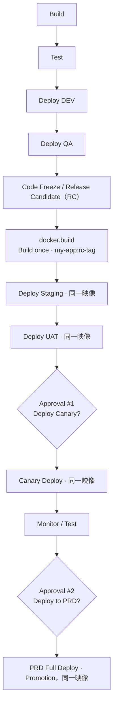
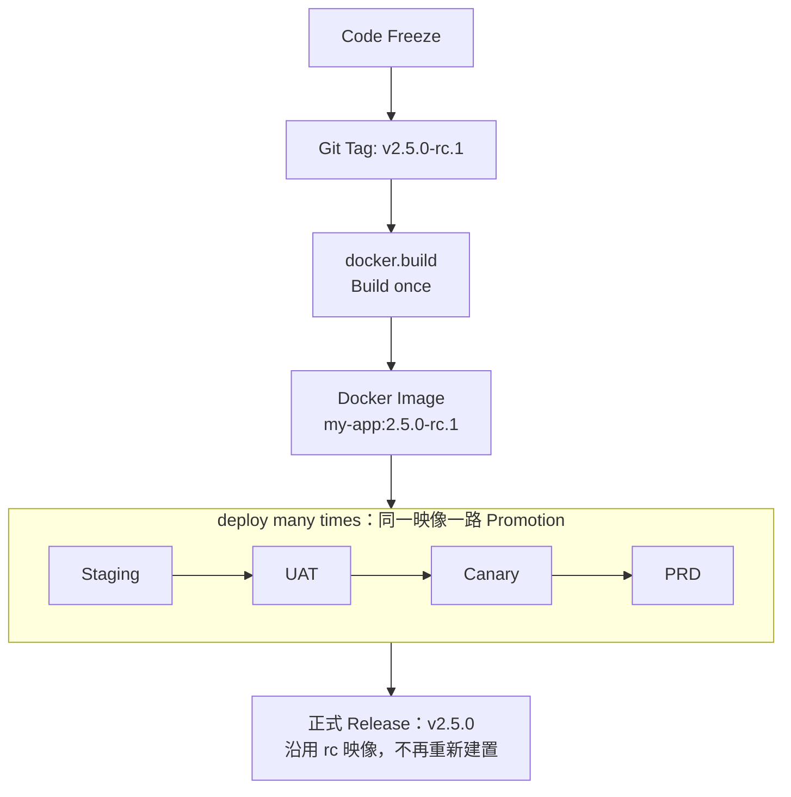

# CI/CD Pipeline

船廠研發團隊部署至遠端艦隊。

## 簡介

## 工具與技術

- 版本控制與協作（Git、GitHub）
- 容器化與編排（Docker、Kubernetes）
- 基礎設施與組態管理（Terraform、Ansible）
- 監控與視覺化（Prometheus、Grafana）
- 持續整合與持續部署（Jenkins）

## Pipeline 流程

> Build once, deploy many times

Code Freeze 後只做一次 `docker.build`，正式 Release 以這份映像為準，之後各環境都部署同一份，一路 Promotion 到 PRD，不再重新建置。


```mermaid
flowchart TD
    build[Build] --> test[Test]
    test --> dev[Deploy DEV]
    dev --> qa[Deploy QA]
    qa --> freeze["Code Freeze / Release Candidate（RC）"]
    freeze --> docker["docker.build<br/>Build once · my-app:rc-tag"]
    docker --> staging["Deploy Staging · 同一映像"]
    staging --> uat["Deploy UAT · 同一映像"]
    uat --> approval1{"Approval #1<br/>Deploy Canary?"}
    approval1 --> canary["Canary Deploy · 同一映像"]
    canary --> monitor["Monitor / Test"]
    monitor --> approval2{"Approval #2<br/>Deploy to PRD?"}
    approval2 --> prd["PRD Full Deploy · Promotion，同一映像"]
```

## Code Freeze

每週固定一次 Release，Code Freeze 是為了決定這次 Release 的內容


假設這週要發布 `v2.5.0`：


```mermaid
flowchart TD
    freeze[Code Freeze] --> tag["Git Tag: v2.5.0-rc.1"]
    tag --> docker["docker.build<br/>Build once"]
    docker --> image["Docker Image<br/>my-app:2.5.0-rc.1"]
    subgraph promotion["deploy many times：同一映像一路 Promotion"]
        direction LR
        staging[Staging] --> uat[UAT]
        uat --> canary[Canary]
        canary --> prd[PRD]
    end
    image --> promotion
    promotion --> release["正式 Release：v2.5.0<br/>沿用 rc 映像，不再重新建置"]
```

## Jenkins Pipeline

### Multi-stage Pipeline

```
pipeline {
    agent any

    stages {

        stage('Build') {
            steps {
                sh 'npm install'
                sh 'npm run build'
                echo 'Building...'
            }
        }

        stage('Test') {
            steps {
                sh 'npm test'
            }
        }

        stage('Deploy DEV') {
            steps {
                sh './deploy.sh dev'
            }
        }

        stage('Deploy QA') {
            steps {
                sh './deploy.sh qa'
            }
        }

        stage('Docker Build') {
            steps {
                sh 'docker build -t my-app:${TAG} .'
            }
        }

        stage('Deploy Staging') {
            steps {
                sh './deploy.sh staging'
            }
        }

        stage('Deploy UAT') {
            steps {
                sh './deploy.sh uat'
            }
        }

        stage('Approval - Canary') {
            steps {
                input message: 'Approve Canary Deployment?'
            }
        }

        stage('Canary Deploy') {
            steps {
                sh './deploy.sh canary'
            }
        }

        stage('Approval - Production') {
            steps {
                input message: 'Approve Full Production Deployment?'
            }
        }

        stage('Deploy PRD') {
            steps {
                sh './deploy.sh prd'
            }
        }
    }
}
```
