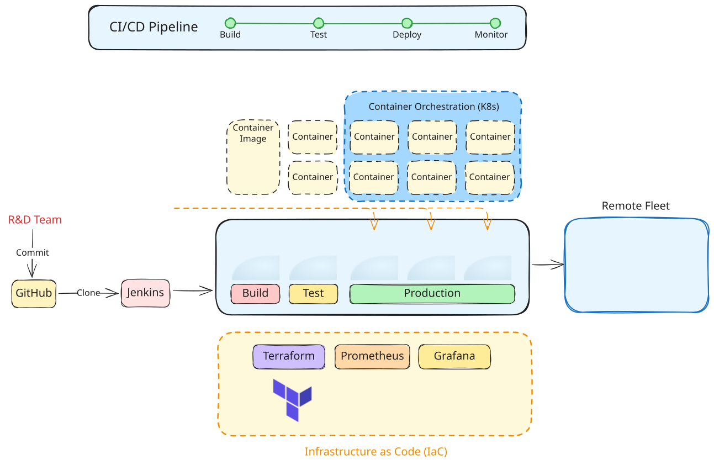
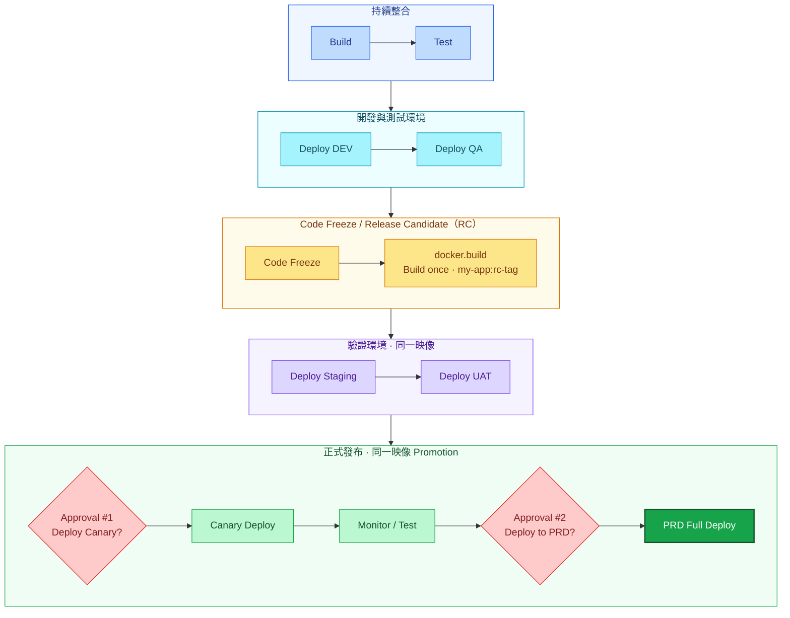
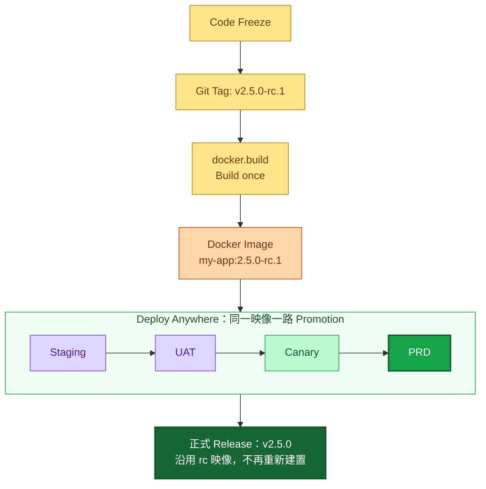

# CI/CD Pipeline

船廠研發團隊把系統部署到遠端艦隊。Jenkins 負責 CI/CD orchestration，Ansible 負責 Remote Deployment；Code Freeze 後只建置一次 Release image，再一路 Promotion 到正式環境。

## 目錄

1. [架構](#架構)
2. [工具與技術](#工具與技術)
3. [Pipeline 流程](#pipeline-流程)
4. [Code Freeze](#code-freeze)
5. [CI/CD Orchestration](#cicd-orchestration)
6. [Canary Remote Deployment](#canary-remote-deployment)

---

## 架構



## 工具與技術

- 版本控制與協作（Git、GitHub）
- 容器化與編排（Docker、Kubernetes）
- 基礎設施與組態管理（Terraform、Ansible）
- 監控與視覺化（Prometheus、Grafana）
- 持續整合與持續部署（Jenkins）

## Pipeline 流程

Code Freeze 後只做一次 `docker.build`，正式 Release 以這份映像為準，之後各環境都部署同一份，一路 Promotion 到 PRD，不再重新建置。

> Build Once, Deploy Anywhere


```mermaid
flowchart TD
    subgraph ci["持續整合"]
        direction LR
        build[Build] --> test[Test]
    end

    subgraph devqa["開發與測試環境"]
        direction LR
        dev[Deploy DEV] --> qa[Deploy QA]
    end

    subgraph rc["Code Freeze / Release Candidate（RC）"]
        direction LR
        freeze[Code Freeze] --> docker["docker.build<br/>Build once · my-app:rc-tag"]
    end

    subgraph preprod["驗證環境 · 同一映像"]
        direction LR
        staging[Deploy Staging] --> uat[Deploy UAT]
    end

    subgraph release["正式發布 · 同一映像 Promotion"]
        direction LR
        approval1{"Approval #1<br/>Deploy Canary?"} --> canary[Canary Deploy]
        canary --> monitor["Monitor / Test"]
        monitor --> approval2{"Approval #2<br/>Deploy to PRD?"}
        approval2 --> prd[PRD Full Deploy]
    end

    ci --> devqa
    devqa --> rc
    rc --> preprod
    preprod --> release

    classDef ciNode fill:#bfdbfe,stroke:#2563eb,color:#1e3a8a
    classDef devqaNode fill:#a5f3fc,stroke:#0891b2,color:#164e63
    classDef rcNode fill:#fde68a,stroke:#d97706,color:#78350f
    classDef preprodNode fill:#ddd6fe,stroke:#7c3aed,color:#4c1d95
    classDef releaseNode fill:#bbf7d0,stroke:#16a34a,color:#14532d
    classDef approvalNode fill:#fecaca,stroke:#dc2626,color:#7f1d1d
    classDef prdNode fill:#16a34a,stroke:#14532d,color:#ffffff,stroke-width:2px

    class build,test ciNode
    class dev,qa devqaNode
    class freeze,docker rcNode
    class staging,uat preprodNode
    class canary,monitor releaseNode
    class approval1,approval2 approvalNode
    class prd prdNode

    style ci fill:#eff6ff,stroke:#2563eb,color:#1e3a8a
    style devqa fill:#ecfeff,stroke:#0891b2,color:#164e63
    style rc fill:#fffbeb,stroke:#d97706,color:#78350f
    style preprod fill:#f5f3ff,stroke:#7c3aed,color:#4c1d95
    style release fill:#f0fdf4,stroke:#16a34a,color:#14532d
```

## Code Freeze

每週固定一次 Release，Code Freeze 是為了決定這次 Release 的內容


假設這週要發布 `v2.5.0`：


```mermaid
flowchart TD
    freeze[Code Freeze] --> tag["Git Tag: v2.5.0-rc.1"]
    tag --> docker["docker.build<br/>Build once"]
    docker --> image["Docker Image<br/>my-app:2.5.0-rc.1"]
    subgraph promotion["Deploy Anywhere：同一映像一路 Promotion"]
        direction LR
        staging[Staging] --> uat[UAT]
        uat --> canary[Canary]
        canary --> prd[PRD]
    end
    image --> promotion
    promotion --> release["正式 Release：v2.5.0<br/>沿用 rc 映像，不再重新建置"]

    classDef rcNode fill:#fde68a,stroke:#d97706,color:#78350f
    classDef imageNode fill:#fed7aa,stroke:#c2410c,color:#7c2d12
    classDef preprodNode fill:#ddd6fe,stroke:#7c3aed,color:#4c1d95
    classDef canaryNode fill:#bbf7d0,stroke:#16a34a,color:#14532d
    classDef prdNode fill:#16a34a,stroke:#14532d,color:#ffffff,stroke-width:2px
    classDef releaseNode fill:#166534,stroke:#14532d,color:#ffffff,stroke-width:2px

    class freeze,tag,docker rcNode
    class image imageNode
    class staging,uat preprodNode
    class canary canaryNode
    class prd prdNode
    class release releaseNode

    style promotion fill:#f0fdf4,stroke:#16a34a,color:#14532d
```

## CI/CD Orchestration

Jenkins 負責 CI/CD orchestration。各部署 stage 執行 `deploy.sh`。

### Jenkins Pipeline

```
pipeline {
    agent any

    stages {

        stage('Build') {
            steps {
                sh 'npm install'
                sh 'npm run build'
                echo 'Building...'
            }
        }

        stage('Test') {
            steps {
                sh 'npm test'
            }
        }

        stage('Deploy DEV') {
            steps {
                sh './deploy.sh dev'
            }
        }

        stage('Deploy QA') {
            steps {
                sh './deploy.sh qa'
            }
        }

        stage('Docker Build') {
            steps {
                sh 'docker build -t my-app:${TAG} .'
            }
        }

        stage('Deploy Staging') {
            steps {
                sh './deploy.sh staging'
            }
        }

        stage('Deploy UAT') {
            steps {
                sh './deploy.sh uat'
            }
        }

        stage('Approval - Canary') {
            steps {
                input message: 'Approve Canary Deployment?'
            }
        }

        stage('Canary Deploy') {
            steps {
                sh './deploy.sh canary'
            }
        }

        stage('Approval - Production') {
            steps {
                input message: 'Approve Full Production Deployment?'
            }
        }

        stage('Deploy PRD') {
            steps {
                sh './deploy.sh prd'
            }
        }
    }
}
```

## Canary Remote Deployment

- 假設艦隊有 10 艘船，即 10 台 server node
- Jenkins 負責 CI/CD orchestration：等待人工核准，並決定這次要部署哪一批節點
- Ansible 負責 Remote Deployment：SSH to remote host、apply configuration、run 同一份 Release image

Jenkins 的 Canary / PRD stage 分別執行 `./deploy.sh canary` 與 `./deploy.sh prd`。`deploy.sh` 再呼叫同一份 Ansible playbook `deploy.yml`，差別只在目標主機範圍。

| 階段 | Jenkins 決策 | Ansible 實際部署 |
| --- | --- | --- |
| Canary Deploy | Approval #1 通過後，只選 1 台 | 1 / 10 |
| PRD Full Deploy | Monitor / Test 確認 Canary 沒問題，且 Approval #2 通過後 | 10 / 10 |

Inventory：

```ini
[canary]
vessel-01

[fleet]
vessel-01
vessel-02
vessel-03
vessel-04
vessel-05
vessel-06
vessel-07
vessel-08
vessel-09
vessel-10
```

Canary 階段只對 `canary` 群組遠端部署，其餘 9 台維持現行版本：

```bash
ansible-playbook deploy.yml --limit canary
```

Canary 節點確認沒問題後，PRD 階段對整個 `fleet` 遠端部署：

```bash
ansible-playbook deploy.yml --limit fleet
```
