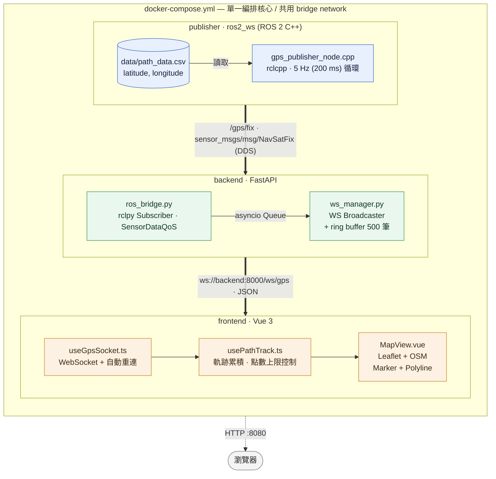

# PLAN — ROS 2 + Web 實時路徑監控系統

> 開發計畫書：將 ROS 2 模擬產生的 GNSS 數據，經由 FastAPI 橋接器即時推送至 Vue 3 網頁儀表板，並在地圖上繪製無人載具的即時位置與歷史路徑。

---

## Table of Contents

1. [Architecture at a Glance](#architecture-at-a-glance)
2. [Task Breakdown & Implementation Steps](#task-breakdown--implementation-steps)
3. [Risk & Mitigation](#risk--mitigation)
4. [Milestone Summary](#milestone-summary)

---

## Architecture at a Glance

### 系統資料流



### 技術選型

| 層級 | 技術 | 說明 |
| :--- | :--- | :--- |
| Publisher | ROS 2 Humble + C++ (`rclcpp`) | `sensor_msgs/msg/NavSatFix`、`create_wall_timer(200ms)` |
| Backend | Python 3.10 + FastAPI + `rclpy` + `uvicorn` | ROS 2 Subscriber 與 WebSocket 端點共存於同一 event loop |
| Frontend | Vue 3 (Composition API) + Vite + Leaflet | OpenStreetMap tile、原生 `WebSocket` API |
| 部署 | Docker + Docker Compose | 三個獨立鏡像、一鍵 `docker compose up` |

### 介面契約（Interface Contract）

| 介面 | 位址 / 名稱 | 格式 |
| :--- | :--- | :--- |
| ROS 2 Topic | `/gps/fix` | `sensor_msgs/msg/NavSatFix`（QoS: `SensorDataQoS`, depth 10）|
| WebSocket | `ws://localhost:8000/ws/gps` | JSON 單筆座標推播 |
| Health Check | `GET http://localhost:8000/health` | `{"status":"ok","ros_connected":true}` |
| Frontend | `http://localhost:5173`（dev）/ `http://localhost:8080`（Nginx）| SPA |

WebSocket 推播訊息格式：

```json
{
  "latitude": 22.6273,
  "longitude": 120.3014,
  "altitude": 0.0,
  "status": 0,
  "timestamp": 1757423401.234,
  "frame_id": "gps_link",
  "seq": 42
}
```

### Folder Structure

```
ros2-web-monitoring/
├── ros2_ws/                          # 任務一：GNSS Publisher (ROS 2)
│   ├── src/
│   │   └── gps_publisher/
│   │       ├── src/
│   │       │   └── gps_publisher_node.cpp    # 讀 CSV、5Hz 循環發佈 NavSatFix
│   │       ├── include/gps_publisher/
│   │       │   └── csv_reader.hpp            # CSV 解析（可單元測試）
│   │       ├── launch/
│   │       │   └── gps_publisher.launch.py   # 參數化 csv_path / publish_rate
│   │       ├── config/
│   │       │   └── params.yaml
│   │       ├── CMakeLists.txt
│   │       └── package.xml
│   └── Dockerfile                    # base: ros:humble-ros-base + rmw-cyclonedds-cpp
│
├── backend/                          # 任務二：Backend Bridge (FastAPI)
│   ├── main.py                       # FastAPI app + lifespan 啟動 ROS 2 node
│   ├── ros_bridge.py                 # rclpy Subscriber → asyncio Queue
│   ├── ws_manager.py                 # 連線管理與廣播
│   ├── schemas.py                    # Pydantic 模型（NavSatFix → JSON）
│   ├── requirements.txt
│   └── Dockerfile                    # base: ros:humble-ros-base + python3-pip + rmw-cyclonedds-cpp
│
├── frontend/                         # 任務三：Frontend View (Vue 3)
│   ├── src/
│   │   ├── main.ts
│   │   ├── App.vue
│   │   ├── components/
│   │   │   ├── MapView.vue           # Leaflet 地圖、Marker、Polyline
│   │   │   ├── StatusBar.vue         # 連線狀態、更新頻率
│   │   │   └── TelemetryPanel.vue    # 當前座標數值面板
│   │   ├── composables/
│   │   │   ├── useGpsSocket.ts       # WebSocket 連線 + 自動重連
│   │   │   └── usePathTrack.ts       # 路徑點累積、去重與點數上限控制
│   │   └── types/gps.ts
│   ├── index.html
│   ├── vite.config.ts
│   ├── package.json
│   ├── nginx.conf                    # production 靜態服務 + WS proxy
│   └── Dockerfile                    # multi-stage: node build → nginx
│
├── data/
│   └── path_data.csv                 # 自行產出的 latitude,longitude 路徑點
│
├── docker-compose.yml                # 任務四：整體編排核心（含 network / volume）
├── .env.example                      # ROS_DOMAIN_ID、port、WS URL
├── .dockerignore
├── PLAN.md
└── README.md                         # 架構說明與一鍵啟動指令
```

---

## Task Breakdown & Implementation Steps

**Estimated effort: 7–9 hours.** Phases are ordered by priority; each phase should be independently demo-able.

各 Phase 依序完成後即可單獨驗收：Phase 1 用 `ros2 topic echo` 驗證、Phase 2 用 `websocat` 驗證、Phase 3 用瀏覽器驗證、Phase 4 用 `docker compose up` 驗證。

---

### Phase 0 — Project Foundation (~0.5 hr)

| # | Task | Deliverable |
| :-- | :--- | :--- |
| 0.1 | 建立 Polyglot Monorepo 骨架：`ros2_ws/`、`backend/`、`frontend/`、`data/` | 目錄結構 |
| 0.2 | 產出 `data/path_data.csv`：≥ 50 筆遞增的 `latitude,longitude`（高雄市區路線，約 22.62/120.30 起點） | GPS 路徑資料 |
| 0.3 | 建立 `.gitignore`、`.dockerignore`（排除 `build/`、`install/`、`log/`、`node_modules/`、`__pycache__/`） | 版控與建置忽略規則 |
| 0.4 | 建立 `.env.example`：`ROS_DOMAIN_ID`、`GPS_CSV_PATH`、`PUBLISH_RATE_HZ`、`VITE_WS_URL` | 環境變數契約 |
| 0.5 | 確認介面契約（Topic 名稱、WS 路徑、JSON 欄位）並寫入 `README.md` 骨架 | 契約文件 |

**Phase 0 acceptance criteria:**

- `data/path_data.csv` 首行為 `latitude,longitude`，所有座標可在地圖上連成一條連續、不跳點的路線
- 三個子專案目錄與環境變數命名一致，後續 Phase 無需再改動契約
- `git status` 乾淨，不含任何建置產物

---

### Phase 1 — GNSS Publisher (ROS 2 C++) (~2 hr)

| # | Task | Deliverable |
| :-- | :--- | :--- |
| 1.1 | 建立 ament_cmake package `gps_publisher`：`package.xml` 宣告 `rclcpp` / `sensor_msgs` 依賴 | ROS 2 套件骨架 |
| 1.2 | `csv_reader.hpp`：解析 CSV → `std::vector<GpsPoint>`，處理表頭、空行、格式錯誤 | CSV 解析模組 |
| 1.3 | `gps_publisher_node.cpp`：繼承 `rclcpp::Node`，建立 `/gps/fix` publisher（`sensor_msgs::msg::NavSatFix`） | Publisher 節點 |
| 1.4 | `create_wall_timer(200ms)` 定頻回呼，索引到底自動回捲（cyclic replay），填入 `header.stamp` / `frame_id` / `status` / `covariance` | 5 Hz 循環發佈 |
| 1.5 | 宣告 ROS 參數 `csv_path`、`publish_rate_hz`、`frame_id`、`loop`，並以 `params.yaml` + launch file 帶入 | 參數化配置 |
| 1.6 | `CMakeLists.txt`：`ament_target_dependencies`、`install(TARGETS ...)`、安裝 `launch/` 與 `config/` | 可 `colcon build` |
| 1.7 | 啟動時的防禦性處理：CSV 不存在或為空 → `RCLCPP_FATAL` 並優雅退出（非 crash） | 錯誤處理 |

**Phase 1 acceptance criteria:**

- `colcon build --packages-select gps_publisher` 零 warning 通過
- `ros2 topic hz /gps/fix` 顯示平均頻率 **5.0 Hz ±0.2**
- `ros2 topic echo /gps/fix` 輸出的 `latitude` / `longitude` 與 `path_data.csv` 逐行一致，且走到最後一筆後回到第一筆
- CSV 路徑錯誤時有明確錯誤日誌，不留下殭屍程序

---

### Phase 2 — Backend Bridge (FastAPI) (~2 hr)

| # | Task | Deliverable |
| :-- | :--- | :--- |
| 2.1 | 建立 `requirements.txt`：`fastapi`、`uvicorn[standard]`、`pydantic`（`rclpy` 來自 ROS 2 base image） | 依賴清單 |
| 2.2 | `ros_bridge.py`：`rclpy` Node 訂閱 `/gps/fix`，以 `SensorDataQoS` 對齊 Publisher | ROS 2 Subscriber |
| 2.3 | 在獨立 thread 執行 `rclpy.spin()`，透過 `asyncio.run_coroutine_threadsafe` 將訊息交回 event loop（避免阻塞 FastAPI） | 執行緒橋接 |
| 2.4 | `schemas.py`：`NavSatFix` → Pydantic `GpsFix` 模型（`latitude`/`longitude`/`altitude`/`status`/`timestamp`/`seq`） | JSON 轉換層 |
| 2.5 | `ws_manager.py`：`ConnectionManager` 管理多客戶端，`broadcast()` 逐一推送並自動清除斷線連線 | 廣播管理器 |
| 2.6 | `main.py`：`@app.websocket("/ws/gps")` 端點 + `lifespan` 管理 `rclpy.init/shutdown` | WebSocket 端點 |
| 2.7 | `GET /health` 回報 ROS 連線狀態與最後一筆訊息時間；設定 CORS 允許前端 origin | 健康檢查與 CORS |
| 2.8 | 新連線立即補送最近 N 筆歷史軌跡（in-memory ring buffer，預設 500 筆） | 歷史路徑回填 |

**Phase 2 acceptance criteria:**

- Publisher 執行中時，`websocat ws://localhost:8000/ws/gps` 每秒穩定收到 5 筆 JSON
- JSON 欄位與 Phase 0 契約完全一致，`timestamp` 為 ROS header 時間而非伺服器時間
- 兩個以上客戶端同時連線皆能收到相同資料；任一客戶端斷線不影響其他連線與伺服器存活
- Publisher 未啟動時，`GET /health` 回 `ros_connected: false`，WebSocket 仍可連線且不噴例外

---

### Phase 3 — Frontend View (Vue 3 + Leaflet) (~2 hr)

| # | Task | Deliverable |
| :-- | :--- | :--- |
| 3.1 | `npm create vite@latest`（vue-ts）初始化，安裝 `leaflet` 與 `@types/leaflet` | Vue 3 專案骨架 |
| 3.2 | `types/gps.ts` + `composables/useGpsSocket.ts`：WebSocket 連線、JSON 解析、指數退避自動重連、連線狀態 ref | 通訊層 composable |
| 3.3 | `composables/usePathTrack.ts`：累積座標為 `LatLngTuple[]`，過濾與前一點重複的座標，並限制陣列最多保留最近 10000 點 | 路徑狀態管理 |
| 3.4 | `MapView.vue`：初始化 Leaflet 地圖與 OpenStreetMap tile layer，並正確處理 `onUnmounted` 銷毀 | 地圖容器 |
| 3.5 | 當前位置 `L.marker`（自訂載具圖標）隨新座標更新位置，地圖視角平滑跟隨 | 即時位置標註 |
| 3.6 | 歷史路徑 `L.polyline` 增量 `addLatLng()` 繪製走過的線段（不整條重建） | 歷史路徑線 |
| 3.7 | `StatusBar.vue` / `TelemetryPanel.vue`：連線狀態燈、實際更新頻率、當前經緯度與已行走距離 | 狀態儀表面板 |
| 3.8 | 操作控制：Follow / Free 視角切換、Clear Track 清除軌跡、`VITE_WS_URL` 環境變數化 | 互動控制 |

**Phase 3 acceptance criteria:**

- 瀏覽器開啟即自動連線，Marker 每 200 ms 更新一次且移動連續不抖動
- Polyline 完整呈現載具走過的歷史路徑，與 `path_data.csv` 路線形狀相符
- 手動重啟 Backend 後前端能自動重連並續繪，無需手動 F5
- 長時間執行（>5 分鐘）記憶體與畫面不劣化；DevTools Console 無錯誤

---

### Phase 4 — Containerization & One-command Deploy (~1.5 hr)

| # | Task | Deliverable |
| :-- | :--- | :--- |
| 4.1 | `ros2_ws/Dockerfile`：`ros:humble-ros-base` → `colcon build` → entrypoint `source install/setup.bash` 後 `ros2 launch` | Publisher 鏡像 |
| 4.2 | `backend/Dockerfile`：`ros:humble-ros-base` + `apt install python3-pip`（base image 未預裝）+ `pip install -r requirements.txt` → `uvicorn main:app --host 0.0.0.0` | Backend 鏡像 |
| 4.3 | `frontend/Dockerfile`：multi-stage（`node:20-alpine` build → `nginx:alpine` serve）+ `nginx.conf` 設定 `/ws` proxy 與 SPA fallback | Frontend 鏡像 |
| 4.4 | `docker-compose.yml`：定義 `publisher` / `backend` / `frontend` 三個 service 與共用 bridge network | 編排核心 |
| 4.5 | 跨容器 ROS 2 DDS 通訊：三個 service 共用 compose bridge network、統一 `ROS_DOMAIN_ID`；兩個 ROS 鏡像加裝 `ros-humble-rmw-cyclonedds-cpp` 並統一 `RMW_IMPLEMENTATION=rmw_cyclonedds_cpp`（避開 Fast DDS 跨容器 SHM transport 的錯誤日誌） | DDS 連通性 |
| 4.6 | Volume 掛載 `./data:/data:ro` 供 Publisher 讀取 CSV；port 映射 `8000`（backend）/ `8080`（frontend） | 資料與埠口 |
| 4.7 | `depends_on` + backend `healthcheck`，確保啟動順序為 backend ready → frontend | 啟動依賴 |
| 4.8 | 更新 `README.md`：架構圖、一鍵啟動指令、環境變數表、常見問題排查 | 部署文件 |

**Phase 4 acceptance criteria:**

- 在乾淨環境執行 `docker compose up --build`，**無需任何額外手動設定**即可運作
- 瀏覽器開啟 `http://localhost:8080` 立即看到地圖上的移動載具與路徑
- `docker compose logs` 三個服務皆無 error；`docker compose down` 能乾淨移除容器與網路
- 重複 `docker compose up` 具冪等性（不會因殘留狀態失敗）

---

### Phase 5 — Hardening, Tests & Demo (~1 hr, optional / stretch)

| # | Task | Deliverable |
| :-- | :--- | :--- |
| 5.1 | `csv_reader` 單元測試（`ament_cmake_gtest`）：表頭、空行、非法數值 | C++ 測試 |
| 5.2 | Backend `pytest`：`NavSatFix` → JSON 轉換與 `ws_manager` 廣播/斷線行為 | Python 測試 |
| 5.3 | 韌性驗證：Publisher / Backend 任一重啟後系統自我恢復 | 故障復原報告 |
| 5.4 | 前端效能：點數超過上限時，以 Douglas–Peucker 演算法簡化路徑（合併近似共線的點），在視覺形狀不變的前提下減少 Polyline 頂點數 | 長時運行優化 |
| 5.5 | 錄製 30 秒 Demo GIF 並嵌入 `README.md` | Demo 素材 |

**Phase 5 acceptance criteria:**

- `colcon test` 與 `pytest` 全數通過
- 任一服務被 `docker restart` 後，前端於 10 秒內自動恢復即時更新
- README 具備可直接觀看的 Demo 動畫與完整啟動說明

---

## Risk & Mitigation

| 風險 | 影響 | 對策 |
| :--- | :--- | :--- |
| 容器間 DDS discovery 失敗（multicast 受限） | Backend 收不到 `/gps/fix` | 統一 `ROS_DOMAIN_ID` 並改用 Cyclone DDS；仍不通時讓 publisher 以 `network_mode: "service:backend"` 共用網路命名空間走 loopback |
| `rclpy.spin()` 阻塞 FastAPI event loop | WebSocket 停止推播 | Subscriber 跑在獨立 thread，以 `run_coroutine_threadsafe` 回拋 |
| Publisher 先啟動、Backend 尚未 ready | 前端初始畫面空白 | Backend ring buffer 補送歷史點 + `healthcheck` 控制啟動順序 |
| QoS 不匹配（Sensor vs Default） | 訂閱不到訊息 | 兩端一律使用 `SensorDataQoS`（BEST_EFFORT / depth 10）|
| 前端路徑點無上限累積 | 瀏覽器記憶體膨脹、Polyline 重繪變慢 | `usePathTrack` 只保留最近 10000 點，超出時簡化舊路段 |

---

## Milestone Summary

| Phase | 內容 | 預估工時 | Demo 方式 |
| :-- | :--- | :-- | :--- |
| 0 | Project Foundation | 0.5 hr | 目錄結構 + `path_data.csv` |
| 1 | GNSS Publisher (ROS 2) | 2 hr | `ros2 topic echo /gps/fix` |
| 2 | Backend Bridge (FastAPI) | 2 hr | `websocat ws://localhost:8000/ws/gps` |
| 3 | Frontend View (Vue 3) | 2 hr | 瀏覽器地圖即時軌跡 |
| 4 | Containerization & Deploy | 1.5 hr | `docker compose up` |
| 5 | Hardening & Demo（選配）| 1 hr | 測試報告 + Demo GIF |
| — | **合計** | **7–9 hr** | — |
