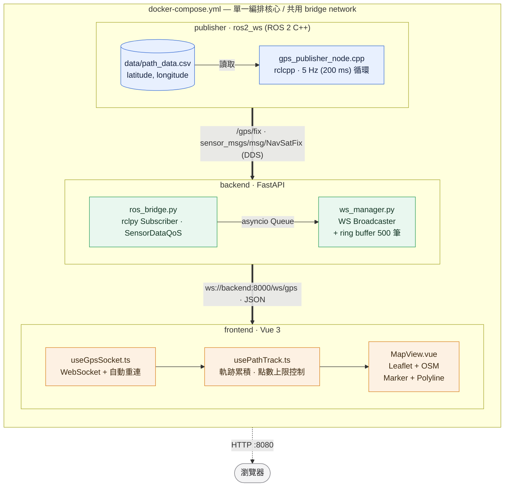

# PLAN_MVP — ROS 2 + Web 實時路徑監控系統

> 輕量 MVP 計畫書：在 macOS 本機不安裝 ROS 2 Humble 的前提下，以 Docker 作為唯一建置／執行環境，完成「CSV → `/gps/fix` → WebSocket → 地圖軌跡」的最小可演示系統。
>
> 本文件是 [PLAN.md](PLAN.md) 的子集與重排，介面契約、技術選型、目錄結構與原計畫一致。

---

## Table of Contents

1. [Architecture at a Glance](#architecture-at-a-glance)
2. [Task Breakdown & Implementation Steps](#task-breakdown--implementation-steps)
3. [Risk & Mitigation](#risk--mitigation)
4. [Milestone Summary](#milestone-summary)

---

## Architecture at a Glance

### 與 PLAN.md 的差異

| 項目 | PLAN.md | 本 MVP |
| :--- | :--- | :--- |
| 開發機 | 假設本機有 Humble，可 `colcon build` | macOS 只當編輯器；Humble 只存在於容器 |
| Phase 順序 | Publisher → Backend → Frontend → Docker | **Docker 空殼先鎖定環境** → Publisher → Backend → Frontend |
| Phase 1 驗收 | 本機 `ros2 topic echo` / `topic hz` | `docker compose build publisher` 通過即可 |
| Phase 5 | 測試、路徑簡化、Demo GIF | 整段不做 |

驗收終點只有一件事：`docker compose up --build` 後，瀏覽器開 `http://localhost:8080`，地圖上的點沿 `path_data.csv` 移動並拖出軌跡。

### 系統資料流



### 技術選型

| 層級 | 技術 | 說明 |
| :--- | :--- | :--- |
| Publisher | ROS 2 Humble + C++ (`rclcpp`) | `sensor_msgs/msg/NavSatFix`、`create_wall_timer(200ms)`；只在容器內 `colcon build` |
| Backend | Python 3.10 + FastAPI + `rclpy` + `uvicorn` | ROS 2 Subscriber 與 WebSocket 端點共存；`rclpy` 來自 Humble image |
| Frontend | Vue 3 (Composition API) + Vite + Leaflet | OpenStreetMap tile、原生 `WebSocket` API |
| 部署 | Docker + Docker Compose | 三個獨立鏡像、一鍵 `docker compose up`；本機不裝 Humble |

### 介面契約（Interface Contract）

| 介面 | 位址 / 名稱 | 格式 |
| :--- | :--- | :--- |
| ROS 2 Topic | `/gps/fix` | `sensor_msgs/msg/NavSatFix`（QoS: `SensorDataQoS`, depth 10）|
| WebSocket | `ws://localhost:8000/ws/gps` | JSON 單筆座標推播 |
| Health Check | `GET http://localhost:8000/health` | `{"status":"ok","ros_connected":true}` |
| Frontend | `http://localhost:5173`（dev）/ `http://localhost:8080`（Nginx）| SPA |

WebSocket 推播訊息格式：

```json
{
  "latitude": 22.6273,
  "longitude": 120.3014,
  "altitude": 0.0,
  "status": 0,
  "timestamp": 1757423401.234,
  "frame_id": "gps_link",
  "seq": 42
}
```

### Folder Structure

```
ros2-web-monitoring/
├── ros2_ws/                          # GNSS Publisher (ROS 2)
│   ├── src/
│   │   └── gps_publisher/
│   │       ├── src/
│   │       │   └── gps_publisher_node.cpp    # 讀 CSV、5Hz 循環發佈 NavSatFix
│   │       ├── include/gps_publisher/
│   │       │   └── csv_reader.hpp            # CSV 解析
│   │       ├── launch/
│   │       │   └── gps_publisher.launch.py   # 參數化 csv_path / publish_rate
│   │       ├── config/
│   │       │   └── params.yaml
│   │       ├── CMakeLists.txt
│   │       └── package.xml
│   └── Dockerfile                    # base: ros:humble-ros-base + rmw-cyclonedds-cpp
│
├── backend/                          # Backend Bridge (FastAPI)
│   ├── main.py                       # FastAPI app + lifespan 啟動 ROS 2 node
│   ├── ros_bridge.py                 # rclpy Subscriber → asyncio Queue
│   ├── ws_manager.py                 # 連線管理與廣播
│   ├── schemas.py                    # Pydantic 模型（NavSatFix → JSON）
│   ├── requirements.txt
│   └── Dockerfile                    # base: ros:humble-ros-base + python3-pip + rmw-cyclonedds-cpp
│
├── frontend/                         # Frontend View (Vue 3)
│   ├── src/
│   │   ├── main.ts
│   │   ├── App.vue
│   │   ├── components/
│   │   │   ├── MapView.vue           # Leaflet 地圖、Marker、Polyline
│   │   │   ├── StatusBar.vue         # 連線狀態
│   │   │   └── TelemetryPanel.vue    # 當前經緯度
│   │   ├── composables/
│   │   │   ├── useGpsSocket.ts       # WebSocket 連線 + 自動重連
│   │   │   └── usePathTrack.ts       # 路徑點累積、去重與點數上限
│   │   └── types/gps.ts
│   ├── index.html
│   ├── vite.config.ts
│   ├── package.json
│   ├── nginx.conf                    # production 靜態服務 + WS proxy
│   └── Dockerfile                    # multi-stage: node build → nginx
│
├── data/
│   └── path_data.csv                 # latitude,longitude 路徑點
│
├── docker-compose.yml                # 整體編排核心（含 network / volume）
├── .env.example                      # ROS_DOMAIN_ID / GPS_CSV_PATH / PUBLISH_RATE_HZ / VITE_WS_URL
├── .dockerignore
├── PLAN.md                           # 完整計畫
├── PLAN_MVP.md                       # 本文件
└── README.md
```

---

## Task Breakdown & Implementation Steps

**Estimated effort: 5.5–7 hours.** Phases are ordered for a macOS host with Docker only; each phase should be independently demo-able **inside Docker**.

本機不執行 `colcon`、`ros2 topic echo`、`ros2 launch`。日常指令只有 `docker compose build` / `docker compose up`。

**Out of scope**

- 本機安裝 ROS 2 Humble / colcon
- [PLAN.md](PLAN.md) Phase 5：gtest、pytest、Douglas–Peucker、Demo GIF、韌性報告
- Follow / Free 視角切換、Clear Track、行走距離

**Phase 0 現況：已完成**（目錄、`path_data.csv`、ignore、`.env.example`、契約）。下方從 Phase 1 開始實作。

---

### Phase 0 — Project Foundation（已完成）

| # | Task | Deliverable |
| :-- | :--- | :--- |
| 0.1 | 建立 Polyglot Monorepo 骨架：`ros2_ws/`、`backend/`、`frontend/`、`data/` | 目錄結構 |
| 0.2 | 產出 `data/path_data.csv`：≥ 50 筆遞增的 `latitude,longitude`（高雄市區路線） | GPS 路徑資料 |
| 0.3 | 建立 `.gitignore`、`.dockerignore` | 版控與建置忽略規則 |
| 0.4 | 建立 `.env.example`：`ROS_DOMAIN_ID`、`GPS_CSV_PATH`、`PUBLISH_RATE_HZ`、`VITE_WS_URL` | 環境變數契約 |
| 0.5 | 介面契約寫入 `README.md` 骨架 | 契約文件 |

**Phase 0 acceptance criteria:** 已滿足，不重做。

---

### Phase 1 — Containerization Shell（先鎖定執行環境）(~1 hr)

對應 [PLAN.md](PLAN.md) Phase 4 的編排部分，但提前到寫應用程式之前。此時原始碼尚未齊全，`docker compose up` 允許失敗；先把 base image、網路、環境變數、volume、埠口定死。

| # | Task | Deliverable |
| :-- | :--- | :--- |
| 1.1 | `ros2_ws/Dockerfile`：`ros:humble-ros-base` + `ros-humble-rmw-cyclonedds-cpp` → `colcon build` → entrypoint `source install/setup.bash` 後 `ros2 launch` | Publisher 鏡像定義 |
| 1.2 | `backend/Dockerfile`：`ros:humble-ros-base` + `apt install python3-pip` + Cyclone DDS + `pip install -r requirements.txt` → `uvicorn main:app --host 0.0.0.0` | Backend 鏡像定義 |
| 1.3 | `frontend/Dockerfile`：multi-stage（`node:20-alpine` build → `nginx:alpine` serve）+ `nginx.conf` 的 `/ws` proxy 與 SPA fallback | Frontend 鏡像定義 |
| 1.4 | `docker-compose.yml`：`publisher` / `backend` / `frontend` 三 service、共用 bridge network | 編排核心 |
| 1.5 | 跨容器 DDS：統一 `ROS_DOMAIN_ID`、`RMW_IMPLEMENTATION=rmw_cyclonedds_cpp` | DDS 連通性契約 |
| 1.6 | Volume `./data:/data:ro`；port `8000`（backend）/ `8080`（frontend）；backend `healthcheck` + frontend `depends_on` | 資料、埠口、啟動順序 |

**Phase 1 acceptance criteria:**

- `docker compose config` 能解析，service / env / volume / port 與 `.env.example` 名稱一致
- 三個 Dockerfile 的 base image 與 entrypoint 已寫明，後續 Phase 只補應用程式、不再改執行環境契約
- 本機無需 Humble；Apple Silicon 優先使用 image 的 `linux/arm64`（若拉取到 amd64 再指定 platform）

---

### Phase 2 — GNSS Publisher (ROS 2 C++) (~2 hr)

對應 [PLAN.md](PLAN.md) Phase 1，build / 跑都在 `publisher` 容器內。

| # | Task | Deliverable |
| :-- | :--- | :--- |
| 2.1 | 補齊 ament_cmake package `gps_publisher`：`package.xml` 已有 `rclcpp` / `sensor_msgs` | ROS 2 套件骨架 |
| 2.2 | `csv_reader.hpp`：解析 CSV → `std::vector<GpsPoint>`，處理表頭、空行、格式錯誤 | CSV 解析模組 |
| 2.3 | `gps_publisher_node.cpp`：繼承 `rclcpp::Node`，建立 `/gps/fix` publisher（`sensor_msgs::msg::NavSatFix`） | Publisher 節點 |
| 2.4 | `create_wall_timer(200ms)` 定頻回呼，索引到底自動回捲（cyclic replay），填入 `header.stamp` / `frame_id` / `status` / `covariance` | 5 Hz 循環發佈 |
| 2.5 | 宣告 ROS 參數 `csv_path`、`publish_rate_hz`、`frame_id`、`loop`，以 `params.yaml` + launch file 帶入 | 參數化配置 |
| 2.6 | `CMakeLists.txt`：`ament_target_dependencies`、`install(TARGETS ...)`、安裝 `launch/` 與 `config/` | 容器內可 `colcon build` |
| 2.7 | CSV 不存在或為空 → `RCLCPP_FATAL` 並優雅退出（非 crash） | 錯誤處理 |

**Phase 2 acceptance criteria:**

- `docker compose build publisher` 成功（等同容器內 `colcon build --packages-select gps_publisher`）
- `docker compose up publisher` 後日誌顯示節點啟動、按 5 Hz 發佈，無 FATAL
- 不要求本機 `ros2 topic echo` / `topic hz`；頻率與座標正確性留到 Phase 3 用 WebSocket 確認

---

### Phase 3 — Backend Bridge (FastAPI) (~1.5–2 hr)

對應 [PLAN.md](PLAN.md) Phase 2。

| # | Task | Deliverable |
| :-- | :--- | :--- |
| 3.1 | `requirements.txt`：`fastapi`、`uvicorn[standard]`、`pydantic`（`rclpy` 來自 ROS 2 base image） | 依賴清單 |
| 3.2 | `ros_bridge.py`：`rclpy` Node 訂閱 `/gps/fix`，以 `SensorDataQoS` 對齊 Publisher | ROS 2 Subscriber |
| 3.3 | 獨立 thread 執行 `rclpy.spin()`，以 `asyncio.run_coroutine_threadsafe` 交回 event loop | 執行緒橋接 |
| 3.4 | `schemas.py`：`NavSatFix` → Pydantic `GpsFix`（欄位與契約一致） | JSON 轉換層 |
| 3.5 | `ws_manager.py`：多客戶端 `broadcast()`，自動清除斷線連線 | 廣播管理器 |
| 3.6 | `main.py`：`/ws/gps` + `lifespan` 管理 `rclpy.init/shutdown`；`GET /health`；CORS | WebSocket 與健康檢查 |
| 3.7 | 新連線補送 ring buffer 最近最多 500 筆 | 歷史路徑回填 |

**Phase 3 acceptance criteria:**

- `docker compose up publisher backend` 後，`GET http://localhost:8000/health` 回 `ros_connected: true`
- `ws://localhost:8000/ws/gps` 可持續收到 JSON，欄位與契約一致，`timestamp` 來自 ROS `header.stamp`
- Publisher 未啟動時 health 仍 200、`ros_connected: false`，WebSocket 可連且不丟例外

---

### Phase 4 — Frontend View + End-to-end Demo (~1.5–2 hr)

對應 [PLAN.md](PLAN.md) Phase 3 的核心畫面，加上整包 `docker compose up --build` 驗收。

| # | Task | Deliverable |
| :-- | :--- | :--- |
| 4.1 | `npm create vite@latest`（vue-ts），安裝 `leaflet` 與 `@types/leaflet` | Vue 3 專案骨架 |
| 4.2 | `types/gps.ts` + `useGpsSocket.ts`：連線、JSON 解析、指數退避重連、連線狀態 | 通訊層 |
| 4.3 | `usePathTrack.ts`：累積 `LatLngTuple[]`、去重、最多保留最近 10000 點 | 路徑狀態 |
| 4.4 | `MapView.vue`：OSM tile、`onUnmounted` 銷毀；Marker 隨座標更新；Polyline 增量繪製 | 地圖 |
| 4.5 | `StatusBar.vue` / `TelemetryPanel.vue`：連線狀態與當前經緯度 | 儀表 |
| 4.6 | `VITE_WS_URL` 環境變數化；production 由 nginx 反代 `/ws` | 連線設定 |
| 4.7 | `docker compose up --build` 三服務一起跑，瀏覽器驗收 | 一鍵演示 |

**Phase 4 acceptance criteria:**

- `docker compose up --build` 無需額外手動設定即可運作
- 瀏覽器開 `http://localhost:8080`：自動連線，Marker 約每 200 ms 更新，Polyline 形狀與 `path_data.csv` 相符
- Backend 重啟後前端能自動重連並續繪
- `docker compose logs` 無明顯 error；`docker compose down` 能乾淨移除

---

### Phase 5 — Hardening, Tests & Demo

不做。完整項目見 [PLAN.md](PLAN.md) Phase 5。

---

## Risk & Mitigation

| 風險 | 影響 | 對策 |
| :--- | :--- | :--- |
| 容器間 DDS discovery 失敗（multicast 受限） | Backend 收不到 `/gps/fix` | 統一 `ROS_DOMAIN_ID` 並改用 Cyclone DDS；仍不通時讓 publisher 以 `network_mode: "service:backend"` 共用網路命名空間走 loopback |
| `rclpy.spin()` 阻塞 FastAPI event loop | WebSocket 停止推播 | Subscriber 跑在獨立 thread，以 `run_coroutine_threadsafe` 回拋 |
| Publisher 先啟動、Backend 尚未 ready | 前端初始畫面空白 | Backend ring buffer 補送歷史點 + `healthcheck` 控制啟動順序 |
| QoS 不匹配（Sensor vs Default） | 訂閱不到訊息 | 兩端一律使用 `SensorDataQoS`（BEST_EFFORT / depth 10）|
| 前端路徑點無上限累積 | 瀏覽器記憶體膨脹 | `usePathTrack` 只保留最近 10000 點 |
| macOS 無 Humble，誤在本機 `colcon` | Phase 卡住 | 本機不裝 ROS；所有 build/run 走 Docker |
| Apple Silicon 拉到 amd64 Humble image | `colcon build` 極慢或失敗 | 優先 `linux/arm64`；必要時再 `--platform linux/amd64` |
| Phase 1 先寫 Dockerfile、原始碼尚未存在 | 過早 `compose up` 失敗 | Phase 1 只驗 `docker compose config`；build 成功列為 Phase 2–4 的驗收 |

---

## Milestone Summary

| Phase | 內容 | 預估工時 | Demo 方式 |
| :-- | :--- | :-- | :--- |
| 0 | Project Foundation | —（已完成） | 目錄結構 + `path_data.csv` |
| 1 | Containerization Shell | 1 hr | `docker compose config` |
| 2 | GNSS Publisher (ROS 2) | 2 hr | `docker compose build publisher` |
| 3 | Backend Bridge (FastAPI) | 1.5–2 hr | `GET /health` + `/ws/gps` JSON |
| 4 | Frontend + 一鍵演示 | 1.5–2 hr | `docker compose up --build` → `:8080` 地圖 |
| 5 | Hardening & Demo | 不做 | — |
| — | **合計** | **5.5–7 hr** | — |
