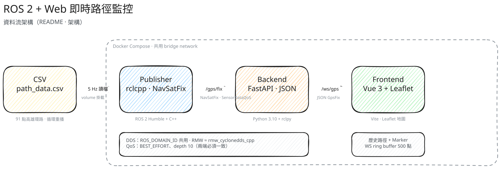
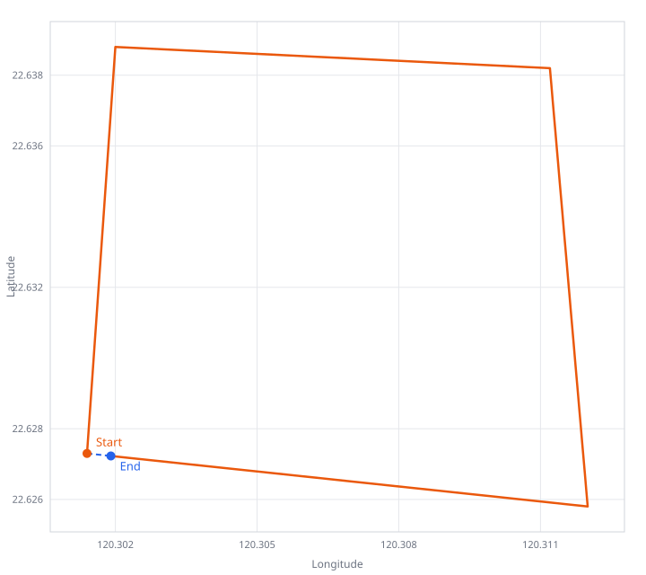

# ROS 2 + Web 實時路徑監控系統

將 ROS 2 模擬產生的 GNSS 數據，經由 FastAPI 橋接器即時推送至 Vue 3 儀表板，並在地圖上繪製無人載具的即時位置與歷史路徑。

開發計畫見 [PLAN_MVP.md](PLAN_MVP.md)。

---

## 目錄

1. [架構](#架構)
2. [安裝與啟動](#安裝與啟動)
3. [介面契約](#介面契約)
4. [環境變數](#環境變數)
5. [路徑資料](#路徑資料)
6. [目錄結構](#目錄結構)

---

## 架構




各層職責如下：

| 層級 | 技術 | 責任 |
| :--- | :--- | :--- |
| Publisher | ROS 2 Humble + C++ (`rclcpp`) | 讀 CSV，以 5 Hz 循環發佈 `NavSatFix` |
| Backend | Python 3.10 + FastAPI + `rclpy` | 訂閱 Topic，轉 JSON，經 WebSocket 廣播 |
| Frontend | Vue 3 + Vite + Leaflet | 連線、繪製 Marker 與歷史路徑 |
| 部署 | Docker Compose | 三個獨立鏡像，共用 bridge network |

---

## 安裝與啟動

建議用 Docker Compose 一次帶起 publisher、backend、frontend。ROS 2 Humble 只存在於容器內，**本機不必安裝 Humble**（macOS / Apple Silicon 亦同）。

### 方式一：Docker Compose（建議）

第一次會建置三個鏡像，約需數分鐘：

```bash
docker compose up --build
```

啟動完成後：

| 服務 | 位址 | 說明 |
| :--- | :--- | :--- |
| 儀表板 | [http://localhost:8080](http://localhost:8080) | Nginx 提供的 Vue SPA；地圖應出現移動中的 Marker 與路徑 |
| Backend API | [http://localhost:8000/health](http://localhost:8000/health) | `ros_connected` 應為 `true` |
| WebSocket | `ws://localhost:8080/ws/gps` | 瀏覽器走同源；Nginx 反代到 backend `:8000` |

背景執行：

```bash
docker compose up --build -d
docker compose logs -f
```

停止並移除容器：

```bash
docker compose down
```

### 驗證

```bash
curl -s http://localhost:8000/health
```

預期類似：

```json
{
  "status": "ok",
  "ros_connected": true,
  "last_message_time": 1757423401.234
}
```

`ros_connected` 為 `false` 時，多半是 publisher 尚未發佈 `/gps/fix`。可用 `docker compose logs -f publisher` 檢查 CSV 路徑與節點輸出。

### 方式二：本機前端開發（backend / publisher 仍用 Docker）

適合改 Vue 儀表板時熱重載。先讓 ROS 與橋接器在容器裡跑：

```bash
docker compose up --build publisher backend
```

另開一個終端：

```bash
cd frontend
npm install
npm run dev
```

瀏覽器開啟 [http://localhost:5173](http://localhost:5173)。Vite 會把 `/ws` 代理到 `ws://localhost:8000`，因此不必填 `VITE_WS_URL`。

---

## 介面契約

| 介面 | 位址 / 名稱 | 格式 |
| :--- | :--- | :--- |
| ROS 2 Topic | `/gps/fix` | `sensor_msgs/msg/NavSatFix` |
| QoS（兩端必須一致） | — | `SensorDataQoS`：BEST_EFFORT、depth 10 |
| WebSocket | `ws://localhost:8000/ws/gps` | JSON，每筆一則座標 |
| Health Check | `GET http://localhost:8000/health` | 見下方 |
| Frontend | `:5173`（Vite dev）/ `:8080`（Nginx） | SPA |

DDS：publisher 與 backend 共用 `ROS_DOMAIN_ID`，並使用 `RMW_IMPLEMENTATION=rmw_cyclonedds_cpp`。

### WebSocket 推播（`GpsFix`）

頻率與 Publisher 相同（預設 5 Hz）。欄位名稱、型別不可更改。

```json
{
  "latitude": 22.6273,
  "longitude": 120.3014,
  "altitude": 0.0,
  "status": 0,
  "timestamp": 1757423401.234,
  "frame_id": "gps_link",
  "seq": 42
}
```

| 欄位 | 型別 | 來源 | 說明 |
| :--- | :--- | :--- | :--- |
| `latitude` | `number` | `NavSatFix.latitude` | 緯度，十進位度 |
| `longitude` | `number` | `NavSatFix.longitude` | 經度，十進位度 |
| `altitude` | `number` | `NavSatFix.altitude` | 海拔，公尺；CSV 無此欄時填 `0.0` |
| `status` | `integer` | `NavSatFix.status.status` | `sensor_msgs/NavSatStatus`：`-1` NO_FIX、`0` FIX |
| `timestamp` | `number` | `header.stamp` | Publisher 發佈當下的 Unix 秒；Backend 原樣轉發 |
| `frame_id` | `string` | `header.frame_id` | 預設 `"gps_link"` |
| `seq` | `integer` | Publisher 自增計數 | ROS 2 `Header` 無 `seq`，由節點從 0 遞增，循環重播不重置 |

新 WebSocket 連線會立即收到 ring buffer 中最近最多 500 筆歷史點，其後改收即時推播。

### Health Check

```json
{
  "status": "ok",
  "ros_connected": true,
  "last_message_time": 1757423401.234
}
```

| 欄位 | 型別 | 說明 |
| :--- | :--- | :--- |
| `status` | `string` | HTTP 服務存活即為 `"ok"` |
| `ros_connected` | `boolean` | 曾收到 `/gps/fix` 且訂閱仍有效時為 `true`；Publisher 未啟動時為 `false` |
| `last_message_time` | `number \| null` | 最近一筆 ROS `header.stamp`（秒）；尚無訊息時為 `null` |

Publisher 未啟動時：`GET /health` 仍回 200，`ros_connected` 為 `false`；`/ws/gps` 可連線、不丟例外。

---

## 環境變數

完整預設值見 [`.env.example`](.env.example)。複製為 `.env` 後覆寫。名稱不可更改。

| 變數 | 預設值 | 誰讀取 |
| :--- | :--- | :--- |
| `ROS_DOMAIN_ID` | `0` | publisher、backend |
| `RMW_IMPLEMENTATION` | `rmw_cyclonedds_cpp` | publisher、backend |
| `GPS_CSV_PATH` | `/data/path_data.csv` | publisher（容器內路徑；compose 掛載 `./data:/data:ro`） |
| `PUBLISH_RATE_HZ` | `5` | publisher |
| `BACKEND_PORT` | `8000` | backend、frontend（WS 目標） |
| `FRONTEND_PORT` | `8080` | frontend（Nginx） |
| `VITE_WS_URL` | `ws://localhost:8000/ws/gps` | frontend（Vite 建置時寫入） |

---

## 路徑資料

[`data/path_data.csv`](data/path_data.csv)：高雄市區封閉環路，91 點，相鄰約 50 m。Publisher 索引到底後回到第一筆，接縫與一般點距相同。



```csv
latitude,longitude
22.627300,120.301400
```

- 首行必須為 `latitude,longitude`（無空白）
- 其餘每行兩個十進位度，小數 6 位
- 不含 `altitude`；Publisher 填 `0.0`

---

## 目錄結構

```
ros2-web-monitoring/
├── ros2_ws/                          # GNSS Publisher (ROS 2 C++)
│   ├── src/gps_publisher/
│   │   ├── src/gps_publisher_node.cpp
│   │   ├── include/gps_publisher/csv_reader.hpp
│   │   ├── launch/gps_publisher.launch.py
│   │   ├── config/params.yaml
│   │   ├── CMakeLists.txt
│   │   └── package.xml
│   └── Dockerfile
├── backend/                          # FastAPI 橋接器
│   ├── main.py
│   ├── ros_bridge.py
│   ├── ws_manager.py
│   ├── schemas.py
│   ├── requirements.txt
│   └── Dockerfile
├── frontend/                         # Vue 3 儀表板
│   ├── src/
│   ├── nginx.conf
│   └── Dockerfile
├── data/
│   ├── path_data.csv
│   └── path_shape.svg
├── docker-compose.yml
├── .env.example
├── PLAN.md
├── PLAN_MVP.md
└── README.md
```
